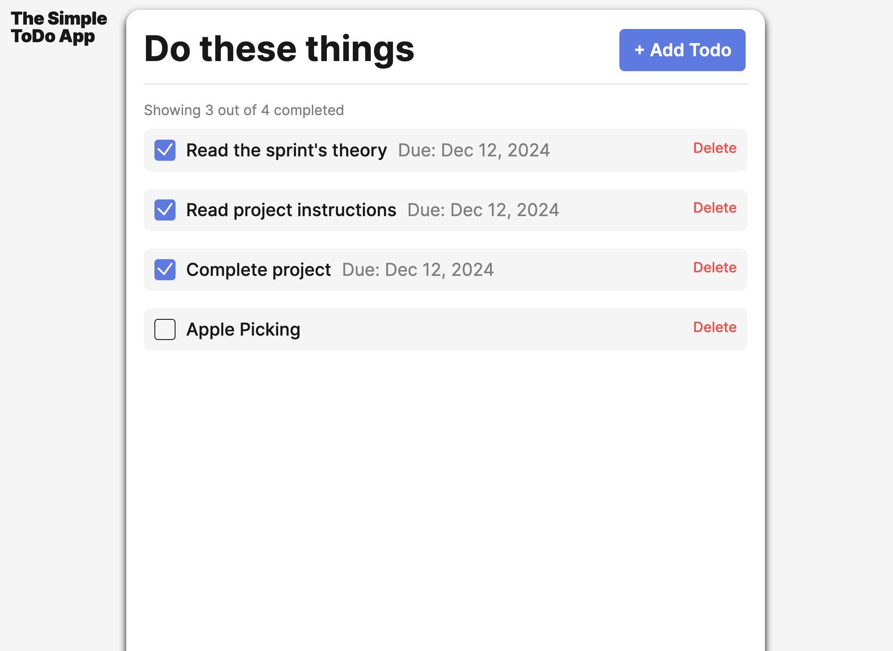
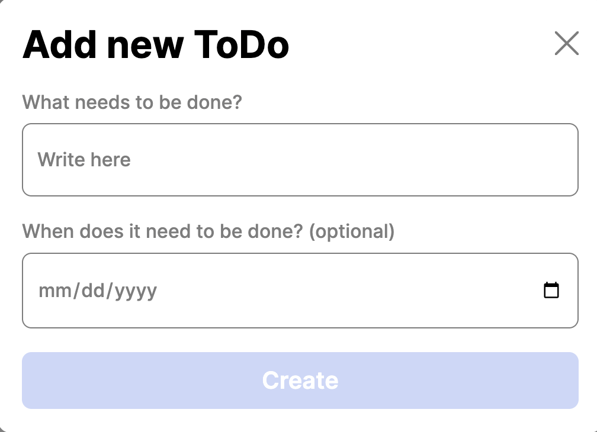

# Simple Todo App

The Simple Todo App is a user-friendly design to assist users with planning out simple tasks at any given time. The user can add new todos with the option of a due date to the list of tasks as well as remove them. Also, there is a checkbox available to mark each todo when completed.

## Functionality

- This application is responsive for both Desktop & Mobile devices
- Add task with description & date
- Check tasks as completed
- Delete tasks when no longer needed

## Technology

- HTML
- CSS
- JavaScript
- UUID for unique id's
- Form Validator

## Screenshots

## Deployment

This project is deployed on GitHub Pages:

<https://kenya-p.github.io/se_project_todo-app/>
